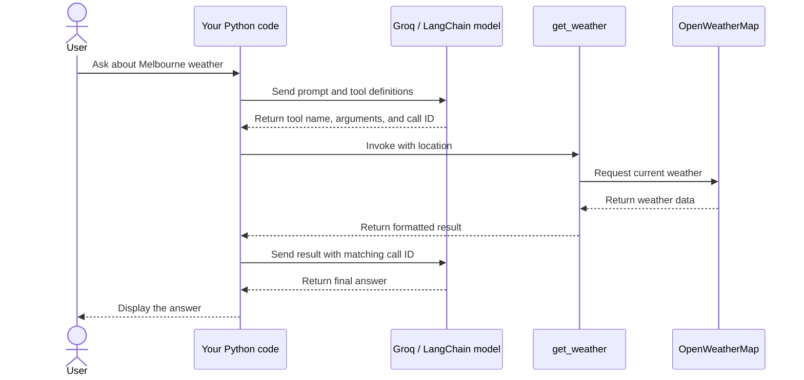

# Tool-calling flow

```mermaid
sequenceDiagram
    actor User
    participant App as Your Python code
    participant LLM as Groq / LangChain model
    participant Tool as get_weather
    participant API as OpenWeatherMap

    User->>App: Ask about Melbourne weather
    App->>LLM: Send prompt and tool definitions
    LLM-->>App: Return tool name, arguments, and call ID
    App->>Tool: Invoke with location
    Tool->>API: Request current weather
    API-->>Tool: Return weather data
    Tool-->>App: Return formatted result
    App->>LLM: Send result with matching call ID
    LLM-->>App: Return final answer
    App-->>User: Display the answer
```
